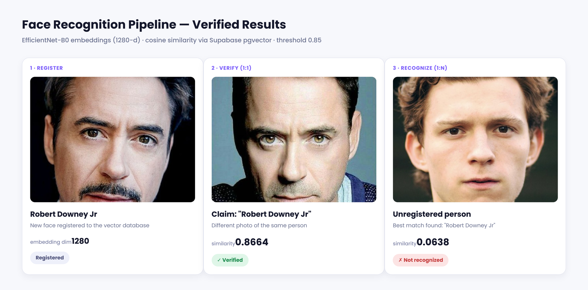

# Face Recognition — Embedding EfficientNet-B0 + pgvector

Pipeline registrasi, verifikasi, dan pengenalan wajah yang dibangun di atas backbone EfficientNet-B0 hasil fine-tuning sebagai feature extractor, dengan pencarian kemiripan (similarity search) memakai Postgres/pgvector di Supabase dan disajikan lewat FastAPI.

*[Read in English](README.md)*

## Gambaran umum

Ada dua hal yang gampang tertukar kalau bicara soal face recognition: **klasifikasi** (mengenali orang-orang yang memang dipakai saat training) dan **pengenalan open-set** (mengenali siapa saja, termasuk orang yang belum pernah dilihat model sebelumnya). Proyek ini memisahkan keduanya dengan pendekatan yang sama dipakai kebanyakan sistem face recognition di production:

1. Latih classifier CNN biasa pada dataset wajah berlabel.
2. Buang classifier head-nya, sisakan cuma backbone konvolusinya.
3. Pakai fitur di lapisan sebelum classifier itu sebagai embedding berdimensi tetap.
4. Bandingkan antar embedding pakai cosine similarity, bukan bergantung pada daftar label tetap dari classifier.

Langkah terakhir itu yang bikin API-nya bisa mendaftarkan orang baru kapan saja tanpa perlu training ulang.

## Cara kerja

| Tahap | Alur |
|---|---|
| **Register** | foto → deteksi & alignment wajah (MTCNN) → embedding (EfficientNet-B0) → disimpan di `face_embeddings` (Supabase/pgvector) |
| **Verify (1:1)** | foto + nama yang diklaim → embedding → cosine similarity dibandingkan dengan *satu* vektor tersimpan itu → diterima/ditolak di threshold 0.85 |
| **Recognize (1:N)** | foto → embedding → cosine similarity dibandingkan dengan *semua* vektor tersimpan → hasil kecocokan terbaik dikembalikan |

## Hasil terverifikasi

**Training backbone** — EfficientNet-B0 di-fine-tune sebagai classifier 16 identitas, lalu classifier head-nya dibuang dan backbone-nya dipakai ulang sebagai embedder.

| Metrik | Nilai |
|---|---|
| Jumlah kelas | 16 identitas |
| Akurasi test | 95% (131 gambar held-out, split sudah di-seed) |
| Dimensi embedding | 1280 |

**Tes pipeline end-to-end** — tiga panggilan API terpisah, pakai foto yang sama sekali tidak pernah masuk data training:

| Tes | Similarity | Hasil |
|---|---|---|
| Orang sama, foto beda (verification) | 0.8664 | ✓ Terverifikasi |
| Orang sama, foto sama persis (recognition, 1:N) | 1.0000 | ✓ Dikenali |
| Orang beda, belum pernah diregister (recognition, 1:N) | 0.0638 | ✗ Tidak dikenali |



Jarak antara 0.0638 dan 0.8664 itu bagian yang paling penting: itu bukti kalau ruang embedding-nya beneran memisahkan identitas orang, bukan cuma menghasilkan vektor yang mirip-mirip terus siapapun orangnya.

## Tech stack

- **PyTorch** + **torchvision** (EfficientNet-B0)
- **facenet-pytorch** (deteksi & alignment wajah MTCNN)
- **FastAPI** + **Uvicorn** + **pyngrok** (serving, di-tunnel keluar dari Google Colab)
- **Supabase** (Postgres + **pgvector** untuk cosine similarity search)
- **Google Colab** (training & runtime GPU)

## Struktur project

```
├── Face_Recognition_Training.ipynb   # melatih classifier, ekspor backbone-nya
├── Face_Recognition_Serving.ipynb    # aplikasi FastAPI: register / verify / recognize
├── images/
│   └── pipeline-results.png
└── README.md / README.id.md
```

## Cara menjalankan sendiri

**1. Training**
- Buka `Face_Recognition_Training.ipynb` di Colab (runtime GPU).
- Arahkan `data_dir` ke folder foto wajah berstruktur `faces_data/<nama_orang>/*.jpg`.
- Jalankan semua cell. Checkpoint otomatis tersimpan ke Google Drive.

**2. Siapkan Supabase**
- Buat project gratis di [supabase.com](https://supabase.com).
- Ambil **connection string**-nya (mode Session pooler atau Transaction pooler — bukan "Direct connection", karena jaringan Colab cuma IPv4) dari *Project Settings → Database*.

**3. Serving**
- Buka `Face_Recognition_Serving.ipynb` di Colab.
- Tambahkan dua Colab Secrets: `SUPABASE_DB_URL` dan `NGROK_AUTHTOKEN` (keduanya juga bisa diisi manual sebagai fallback kalau belum diset).
- Jalankan semua cell. Cell terakhir mencetak URL publik ngrok.
- Buka `<url-tadi>/docs` untuk halaman Swagger UI interaktif, bisa langsung coba ketiga endpoint tanpa nulis kode client apapun.

## Endpoint

| Method | Path | Body | Fungsi |
|---|---|---|---|
| `POST` | `/face_register/?name=...` | file gambar | Registrasi wajah baru |
| `POST` | `/face_verification/?name=...` | file gambar | Cek 1:1 terhadap satu identitas yang diklaim |
| `POST` | `/face_recognition/` | file gambar | Cari 1:N di seluruh wajah yang terdaftar |

## Keterbatasan yang diketahui

- **Preprocessing training dan serving berbeda.** Training me-resize foto mentah langsung; serving menjalankan deteksi & alignment MTCNN dulu. Keduanya tetap jalan, tapi cara memproses gambarnya nggak identik — dataset dengan wajah yang sudah di-crop rapi dan cukup di tengah sebagian besar menutupi efek ini, tapi tetap perlu diperhatikan kalau dipakai untuk foto yang lebih berantakan.
- **Akurasi 95% yang dilaporkan berasal dari satu split train/test yang sudah di-seed**, di dataset yang tergolong kecil (16 kelas). Ini sinyal yang masuk akal, bukan benchmark yang ketat — tidak ada cross-validation yang dijalankan.
- **Serving ini ditujukan untuk eksperimen lokal, bukan hosting production.** FastAPI + ngrok di dalam notebook Colab memang menghasilkan API yang beneran bisa dipanggil untuk testing, tapi tunnel-nya mati begitu runtime Colab-nya berhenti — bukan target deployment.
- Belum ada rate limiting, autentikasi, atau pengecekan duplikasi registrasi di endpoint-nya. Siapapun yang punya URL-nya bisa register, verify, atau query selama tunnel-nya masih hidup.

## Lisensi

MIT — lihat [LICENSE](LICENSE).
